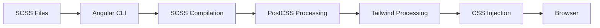

# Styling Architecture Documentation

## Overview

This Angular project implements a sophisticated multi-layered styling architecture that combines Angular Material 3, Tailwind CSS, and custom design tokens to create a cohesive, maintainable, and scalable design system.

## Table of Contents

- [Architecture Overview](#architecture-overview)
- [Core Technologies](#core-technologies)
- [File Structure](#file-structure)
- [Style Loading System](#style-loading-system)
- [Theming System](#theming-system)
- [Component Styling Approach](#component-styling-approach)
- [Typography System](#typography-system)
- [Color System](#color-system)
- [Responsive Design](#responsive-design)
- [Dark/Light Theme Implementation](#darklight-theme-implementation)
- [Custom Utilities](#custom-utilities)
- [Performance Considerations](#performance-considerations)
- [Development Guidelines](#development-guidelines)
- [Troubleshooting](#troubleshooting)

## Architecture Overview

The styling system is built on three main pillars:

1. **Angular Material 3** - Component library with Material Design 3 theming
2. **Tailwind CSS** - Utility-first CSS framework
3. **Custom Design Tokens** - Material Design 3 semantic color system

### Design Philosophy

- **Utility-First**: Components use utility classes instead of component-specific stylesheets
- **Design Token Driven**: All colors, typography, and spacing use semantic tokens
- **Theme Agnostic**: Components work seamlessly across light/dark themes
- **Performance Focused**: Optimized bundle sizes and efficient CSS delivery

## Core Technologies

| Technology | Version | Purpose |
|------------|---------|---------|
| Angular Material | 19.2.9 | Component library and theming foundation |
| Tailwind CSS | 4.1.4 | Utility-first CSS framework |
| PostCSS | 8.5.3 | CSS processing and Tailwind compilation |
| SCSS | Latest | CSS preprocessing and Angular Material theming |

## File Structure

```
angular-web-ui/src/
├── styles.scss                           # Main Angular Material theme
├── tokens.scss                           # Material Design 3 color tokens
├── _variables.scss                       # Typography variables
└── app/ngm-dev-blocks/styles/
    ├── ngm-dev-blocks-styles.scss        # Main component library styles
    ├── _base.scss                        # Base HTML styling
    ├── _dialogs.scss                     # Dialog component overrides
    ├── _sizes.scss                       # Density utilities
    ├── _tabs.scss                        # Tab component styling
    ├── themes/
    │   ├── _dark.scss                    # Dark theme utilities
    │   └── _warn.scss                    # Warning/error theme
    └── vendors/
        └── _tailwind.css                 # Tailwind integration & custom utilities
```

## Style Loading System

### Angular CLI Configuration

Styles are automatically loaded via `angular.json`:

```json
"styles": [
  "src/styles.scss",                                          // 1. Angular Material theme
  "src/tokens.scss",                                          // 2. Design tokens
  "src/app/ngm-dev-blocks/styles/ngm-dev-blocks-styles.scss"  // 3. Component library
]
```

### Loading Order & Cascade

1. **Angular Material Base** - Core component styles and theme foundation
2. **Design Tokens** - CSS custom properties for colors and typography
3. **Component Library** - Custom components and utility classes
4. **Tailwind Utilities** - Utility classes with highest specificity

### Build Process



## Theming System

### Material Design 3 Implementation

The project uses the latest Material Design 3 theming system:

```scss
// styles.scss
html {
  color-scheme: light;
  @include mat.theme((
    color: (
      primary: mat.$azure-palette,
      tertiary: mat.$blue-palette,
    ),
    typography: (
      plain-family: #{meta.inspect(variables.$regular-font-family)},
      brand-family: #{meta.inspect(variables.$heading-font-family)},
    ),
    density: 0,
  ));
}
```

### Theme Structure

#### Light Theme (Default)
- Applied to `:root` and `:host` selectors
- Uses bright surfaces and dark text
- Primary color: Azure palette

#### Dark Theme
- Applied via `.dark-theme` class
- Uses dark surfaces and light text
- Automatically inverts semantic colors

### Theme Switching Mechanism

```typescript
// Theme switching logic
private applyTheme(isDark: boolean): void {
  const htmlElement = document.documentElement;
  
  if (isDark) {
    htmlElement.classList.add('dark-theme');
  } else {
    htmlElement.classList.remove('dark-theme');
  }
}
```

## Component Styling Approach

### No-CSS Component Strategy

Components use **zero component-specific stylesheets**:

```typescript
@Component({
  selector: 'app-example',
  templateUrl: './example.component.html',
  // No styleUrls - relies on global styles and utilities
  imports: [/* Material components */]
})
```

### Styling Sources Hierarchy

1. **Angular Material Components**
   ```html
   <mat-card appearance="outlined">
     <mat-form-field>
   ```

2. **Tailwind Utilities**
   ```html
   <div class="p-4 max-w-7xl mx-auto grid md:grid-cols-2 gap-6">
   ```

3. **Custom Utilities**
   ```html
   <mat-icon class="form-field-error-icon">error</mat-icon>
   <div class="density-3">
   ```

### Example: Login Component Analysis

```html
<!-- Combines all styling approaches -->
<form class="p-4 max-w-7xl mx-auto">                    <!-- Tailwind utilities -->
  <mat-card appearance="outlined">                       <!-- Material component -->
    <div class="grid md:grid-cols-2 gap-6">            <!-- Tailwind responsive -->
      <mat-form-field class="w-full">                   <!-- Material + Tailwind -->
        <mat-icon class="form-field-error-icon">        <!-- Custom utility -->
      </mat-form-field>
    </div>
  </mat-card>
</form>
```

## Typography System

### Font Configuration

```scss
// _variables.scss
$heading-font-family: Poppins, sans-serif;    // Display/headings
$regular-font-family: Inter, sans-serif;      // Body text
```

### Font Loading

```html
<!-- index.html -->
<link href="https://fonts.googleapis.com/css2?family=Inter:ital,opsz,wght@0,14..32,100..900&family=Poppins:ital,wght@0,100;0,200;0,300;0,400;0,500;0,600;0,700;0,800;0,900&display=swap" rel="stylesheet" />
```

### Typography Scale

Material Design 3 provides a comprehensive typography scale:

| Token | Usage | Font Family |
|-------|-------|-------------|
| `--mat-sys-display-large` | Hero headings | Poppins |
| `--mat-sys-headline-large` | Page titles | Poppins |
| `--mat-sys-title-large` | Section headers | Poppins |
| `--mat-sys-body-large` | Body text | Inter |
| `--mat-sys-label-large` | Button labels | Inter |

### Tailwind Integration

```css
/* Typography tokens available in Tailwind */
--font-sans: var(--mat-sys-body-large-font), sans-serif;
--font-display: var(--mat-sys-display-large-font), sans-serif;
```

## Color System

### Semantic Color Tokens

The project uses Material Design 3's semantic color system:

#### Primary Colors
- `--mat-sys-primary` - Main brand color
- `--mat-sys-on-primary` - Text on primary surfaces
- `--mat-sys-primary-container` - Tinted primary surfaces
- `--mat-sys-on-primary-container` - Text on primary containers

#### Surface Colors
- `--mat-sys-surface` - Default background
- `--mat-sys-surface-container` - Elevated surfaces
- `--mat-sys-surface-container-high` - Highly elevated surfaces
- `--mat-sys-on-surface` - Default text color

#### State Colors
- `--mat-sys-error` - Error states
- `--mat-sys-error-container` - Error backgrounds
- `--mat-sys-outline` - Borders and dividers

### Tailwind Color Integration

```css
/* Colors available as Tailwind utilities */
@theme inline {
  --color-primary: var(--mat-sys-primary);
  --color-surface: var(--mat-sys-surface);
  --color-error: var(--mat-sys-error);
}
```

Usage:
```html
<div class="bg-primary text-on-primary">
<div class="bg-surface-container-high">
```

## Responsive Design

### Breakpoint System

Uses Tailwind's default breakpoints:

| Prefix | Min Width | Usage |
|--------|-----------|-------|
| `sm:` | 640px | Small tablets |
| `md:` | 768px | Tablets |
| `lg:` | 1024px | Laptops |
| `xl:` | 1280px | Desktops |
| `2xl:` | 1536px | Large screens |

### Responsive Patterns

```html
<!-- Mobile-first responsive grid -->
<div class="grid md:grid-cols-2 lg:grid-cols-3 gap-4">

<!-- Responsive spacing -->
<div class="p-4 md:p-6 lg:p-8">

<!-- Responsive typography -->
<h1 class="text-2xl md:text-3xl lg:text-4xl">
```

### Component Density

```scss
// Density utilities for different screen sizes
.density-1 { @include mat.theme((density: -1)); }
.density-2 { @include mat.theme((density: -2)); }
.density-3 { @include mat.theme((density: -3)); }
.density-4 { @include mat.theme((density: -4)); }
.density-5 { @include mat.theme((density: -5)); }
```

## Dark/Light Theme Implementation

### Theme Service Architecture

```typescript
export type Theme = 'light' | 'dark' | 'auto';

@Injectable({ providedIn: 'root' })
export class ThemeService {
  themeMode = signal<Theme>('auto');
  private systemPrefersDark = signal<boolean>(false);
  
  isDarkMode = computed(() => {
    const mode = this.themeMode();
    switch (mode) {
      case 'dark': return true;
      case 'light': return false;
      case 'auto': return this.systemPrefersDark();
    }
  });
}
```

### System Preference Detection

```typescript
private setupSystemPreferenceListener(): void {
  const mediaQuery = window.matchMedia('(prefers-color-scheme: dark)');
  
  const handleChange = (e: MediaQueryListEvent) => {
    this.systemPrefersDark.set(e.matches);
  };
  
  mediaQuery.addEventListener('change', handleChange);
}
```

### Theme Persistence

```typescript
// Save user preference
localStorage.setItem('themeMode', mode);

// Restore on app load
const savedThemeMode = localStorage.getItem('themeMode') as Theme;
this.themeMode.set(savedThemeMode || 'auto');
```

## Custom Utilities

### Form Field Icons

```css
@utility form-field-error-icon {
  vertical-align: bottom;
  font-variation-settings: 'FILL' 1;
  height: 16px !important;
  width: 16px !important;
  font-size: 16px !important;
}
```

### Icon Utilities

```css
@utility icon-filled {
  font-variation-settings: 'FILL' 1;
}
```

### Dialog Utilities

```scss
.full-screen-dialog {
  @media (width < 40rem) {
    @include mat.dialog-overrides((
      container-shape: 0,
    ));
  }
}
```

### Animation Utilities

```css
/* Fade-in animation */
--animate-fadeIn: fadeIn 300ms ease-in-out forwards var(--animation-delay, 0ms);

/* Marquee animations */
--animate-marquee: marquee var(--duration, 40s) linear infinite;
--animate-marquee-vertical: marquee-vertical var(--duration, 40s) linear infinite;
```

## Performance Considerations

### Bundle Size Optimization

```json
// angular.json - Bundle budgets
"budgets": [
  {
    "type": "initial",
    "maximumWarning": "500kB",
    "maximumError": "1MB"
  },
  {
    "type": "anyComponentStyle",
    "maximumWarning": "4kB",
    "maximumError": "8kB"
  }
]
```

### CSS Optimization Strategies

1. **Utility-First Approach** - Reduces CSS duplication
2. **Tree Shaking** - Tailwind purges unused styles
3. **Component Reuse** - Shared styling patterns
4. **Critical CSS** - Above-the-fold styles prioritized

### Runtime Performance

- **CSS Custom Properties** - Efficient theme switching
- **Hardware Acceleration** - Transform-based animations
- **Minimal Reflows** - Utility classes prevent layout thrashing

## Development Guidelines

### Styling Best Practices

#### ✅ Do's

```html
<!-- Use utility classes -->
<div class="flex items-center gap-4 p-6">

<!-- Use semantic color tokens -->
<div class="bg-surface-container text-on-surface">

<!-- Use Material components -->
<mat-card appearance="outlined">

<!-- Use responsive prefixes -->
<div class="grid md:grid-cols-2 lg:grid-cols-3">
```

#### ❌ Don'ts

```html
<!-- Don't use arbitrary values frequently -->
<div class="p-[23px]">

<!-- Don't use hardcoded colors -->
<div style="background-color: #1976d2;">

<!-- Don't create component-specific stylesheets -->
<!-- Use global utilities instead -->
```

### Component Development Workflow

1. **Start with Material Components**
   ```html
   <mat-card>
     <mat-card-content>
   ```

2. **Add Layout with Tailwind**
   ```html
   <div class="grid md:grid-cols-2 gap-6">
   ```

3. **Apply Spacing and Sizing**
   ```html
   <div class="p-4 max-w-7xl mx-auto">
   ```

4. **Use Custom Utilities for Special Cases**
   ```html
   <mat-icon class="form-field-error-icon">
   ```

### Theme Development

#### Adding New Color Tokens

1. **Update tokens.scss**
   ```scss
   :root {
     --mat-sys-custom-color: #your-color;
   }
   
   .dark-theme {
     --mat-sys-custom-color: #your-dark-color;
   }
   ```

2. **Add to Tailwind theme**
   ```css
   @theme inline {
     --color-custom: var(--mat-sys-custom-color);
   }
   ```

3. **Use in components**
   ```html
   <div class="bg-custom text-on-custom">
   ```

#### Creating Theme Variants

1. **Define variant in themes directory**
   ```scss
   // themes/_success.scss
   .success-theme {
     @include mat.theme-overrides((
       primary: var(--mat-sys-tertiary),
       primary-container: var(--mat-sys-tertiary-container),
       on-primary: var(--mat-sys-on-tertiary),
       on-primary-container: var(--mat-sys-on-tertiary-container),
     ));
   }
   ```

2. **Forward in main styles file**
   ```scss
   // ngm-dev-blocks-styles.scss
   @forward './themes/success';
   ```

3. **Apply conditionally**
   ```html
   <div [class.success-theme]="isSuccess">
   ```

### Typography Customization

#### Adding Custom Font Weights

1. **Update Google Fonts link**
   ```html
   <!-- Add weight ranges -->
   <link href="https://fonts.googleapis.com/css2?family=Inter:wght@100;200;300;400;500;600;700;800;900&display=swap">
   ```

2. **Define in variables**
   ```scss
   // _variables.scss
   $font-weights: (
     thin: 100,
     light: 300,
     regular: 400,
     medium: 500,
     semibold: 600,
     bold: 700,
     extrabold: 800,
     black: 900
   );
   ```

3. **Use in Tailwind config**
   ```css
   @theme inline {
     --font-weight-thin: 100;
     --font-weight-light: 300;
     /* ... */
   }
   ```

## Responsive Design Patterns

### Common Layout Patterns

#### Card Grid Layout
```html
<div class="grid grid-cols-1 md:grid-cols-2 lg:grid-cols-3 xl:grid-cols-4 gap-6">
  @for (item of items; track item.id) {
    <mat-card>
      <!-- Card content -->
    </mat-card>
  }
</div>
```

#### Sidebar Layout
```html
<div class="flex flex-col lg:flex-row min-h-screen">
  <!-- Sidebar -->
  <aside class="w-full lg:w-64 bg-surface-container">
    <!-- Navigation -->
  </aside>
  
  <!-- Main content -->
  <main class="flex-1 p-4 lg:p-8">
    <!-- Page content -->
  </main>
</div>
```

#### Form Layout
```html
<form class="max-w-2xl mx-auto space-y-6">
  <div class="grid grid-cols-1 md:grid-cols-2 gap-4">
    <mat-form-field class="w-full">
      <!-- Form field -->
    </mat-form-field>
  </div>
</form>
```

### Responsive Component Patterns

#### Responsive Navigation
```html
<!-- Mobile: Drawer, Desktop: Persistent sidebar -->
<mat-sidenav-container class="min-h-screen">
  <mat-sidenav 
    #sidenav 
    [mode]="isHandset ? 'over' : 'side'"
    [opened]="!isHandset">
    <!-- Navigation content -->
  </mat-sidenav>
  
  <mat-sidenav-content>
    <!-- Main content -->
  </mat-sidenav-content>
</mat-sidenav-container>
```

#### Responsive Tables
```html
<!-- Desktop: Table, Mobile: Cards -->
<div class="hidden md:block">
  <mat-table [dataSource]="dataSource">
    <!-- Table columns -->
  </mat-table>
</div>

<div class="md:hidden space-y-4">
  @for (item of dataSource.data; track item.id) {
    <mat-card>
      <!-- Card representation of table row -->
    </mat-card>
  }
</div>
```

## Advanced Styling Techniques

### Dynamic Theme Variables

```typescript
// Service for dynamic theme customization
@Injectable()
export class DynamicThemeService {
  updatePrimaryColor(color: string): void {
    document.documentElement.style.setProperty('--mat-sys-primary', color);
  }
  
  updateBorderRadius(radius: string): void {
    document.documentElement.style.setProperty('--mat-sys-corner-medium', radius);
  }
}
```

### CSS-in-TS for Dynamic Styles

```typescript
// Component with dynamic styling
@Component({
  template: `
    <div [style]="dynamicStyles">
      Content with dynamic styles
    </div>
  `
})
export class DynamicComponent {
  @Input() accentColor = '#1976d2';
  
  get dynamicStyles() {
    return {
      '--custom-accent': this.accentColor,
      'background': 'var(--custom-accent)',
      'color': 'white'
    };
  }
}
```

### Animation Integration

```scss
// Custom animations using design tokens
@keyframes slideInFromTop {
  from {
    transform: translateY(-100%);
    opacity: 0;
  }
  to {
    transform: translateY(0);
    opacity: 1;
  }
}

.slide-in {
  animation: slideInFromTop 0.3s var(--mat-sys-motion-easing-standard);
}
```

## Modern Angular Control Flow Updates

### Replace `*ngFor` with `@for`

#### Old Syntax (Deprecated)
```html
<mat-card *ngFor="let item of items">
  <!-- Card content -->
</mat-card>
```

#### New Syntax (Angular 17+)
```html
@for (item of items; track item.id) {
  <mat-card>
    <!-- Card content -->
  </mat-card>
}
```

### Other Control Flow Updates

You should also consider updating other control flow patterns in your documentation:

#### Conditional Rendering
```html
<!-- Old -->
<div *ngIf="showContent">Content</div>

<!-- New -->
@if (showContent) {
  <div>Content</div>
}
```

#### Switch Statements
```html
<!-- Old -->
<div [ngSwitch]="status">
  <span *ngSwitchCase="'loading'">Loading...</span>
  <span *ngSwitchCase="'error'">Error occurred</span>
  <span *ngSwitchDefault>Content loaded</span>
</div>

<!-- New -->
@switch (status) {
  @case ('loading') {
    <span>Loading...</span>
  }
  @case ('error') {
    <span>Error occurred</span>
  }
  @default {
    <span>Content loaded</span>
  }
}
```

### Benefits of New Control Flow

```markdown
## Modern Angular Control Flow (Angular 17+)

### Benefits of New Syntax

1. **Better Performance** - Built-in optimizations and smaller bundle size
2. **Type Safety** - Better TypeScript integration and type checking
3. **Readability** - More intuitive syntax similar to other programming languages
4. **Developer Experience** - Better IDE support and error messages

### Migration Guidelines

When updating existing components:

1. **Replace `*ngFor`** with `@for` and always include `track` for performance
2. **Replace `*ngIf`** with `@if` for conditional rendering
3. **Replace `[ngSwitch]`** with `@switch` for multiple conditions
4. **Update imports** - Remove `CommonModule` imports if only used for structural directives

### Example Migration

```typescript
// Before
@Component({
  imports: [CommonModule, MatCardModule],
  template: `
    <mat-card *ngFor="let item of items; trackBy: trackByFn">
      <div *ngIf="item.visible">{{ item.name }}</div>
    </mat-card>
  `
})

// After
@Component({
  imports: [MatCardModule], // CommonModule no longer needed
  template: `
    @for (item of items; track item.id) {
      <mat-card>
        @if (item.visible) {
          <div>{{ item.name }}</div>
        }
      </mat-card>
    }
  `
})
```

## Testing Strategies

### Visual Regression Testing

```typescript
// Example test setup for theme testing
describe('Theme Integration', () => {
  it('should apply light theme correctly', () => {
    // Test light theme application
    component.themeService.setThemeMode('light');
    fixture.detectChanges();
    
    const element = fixture.debugElement.nativeElement;
    expect(element.classList.contains('dark-theme')).toBeFalsy();
  });
  
  it('should apply dark theme correctly', () => {
    // Test dark theme application
    component.themeService.setThemeMode('dark');
    fixture.detectChanges();
    
    const element = fixture.debugElement.nativeElement;
    expect(element.classList.contains('dark-theme')).toBeTruthy();
  });
});
```

### Accessibility Testing

```typescript
// Test color contrast ratios
describe('Accessibility', () => {
  it('should meet WCAG contrast requirements', () => {
    // Test contrast ratios for different theme combinations
    const contrastRatio = calculateContrastRatio(
      getComputedStyle(element).color,
      getComputedStyle(element).backgroundColor
    );
    
    expect(contrastRatio).toBeGreaterThan(4.5); // WCAG AA standard
  });
});
```

## Performance Monitoring

### Bundle Analysis

```bash
# Analyze bundle size
ng build --stats-json
npx webpack-bundle-analyzer dist/movielogd/stats.json
```

### CSS Performance Metrics

```typescript
// Monitor CSS performance
@Injectable()
export class StylePerformanceService {
  measureStyleRecalculation(): void {
    const observer = new PerformanceObserver((list) => {
      for (const entry of list.getEntries()) {
        if (entry.name === 'style') {
          console.log('Style recalculation time:', entry.duration);
        }
      }
    });
    
    observer.observe({ entryTypes: ['measure'] });
  }
}
```

## Troubleshooting

### Common Issues and Solutions

#### Issue: Styles Not Loading
```bash
# Check build output
ng build --verbose

# Verify style imports in angular.json
# Ensure SCSS compilation is working
```

#### Issue: Theme Not Switching
```typescript
// Debug theme service
console.log('Current theme mode:', this.themeService.themeMode());
console.log('Is dark mode:', this.themeService.isDarkMode());
console.log('HTML classes:', document.documentElement.classList);
```

#### Issue: Tailwind Classes Not Working
```bash
# Verify Tailwind is processing correctly
npm run build -- --verbose

# Check if classes are being purged incorrectly
# Add to safelist in tailwind.config.js if needed
```

#### Issue: Material Components Not Styled
```scss
// Ensure Material theme is properly included
@use '@angular/material' as mat;

// Check if theme is applied to html element
html {
  @include mat.theme($your-theme);
}
```

### Debug Utilities

```scss
// Debug utility for development
.debug-theme {
  &::before {
    content: 'Theme: ' attr(class);
    position: fixed;
    top: 0;
    right: 0;
    background: var(--mat-sys-error-container);
    color: var(--mat-sys-on-error-container);
    padding: 8px;
    font-size: 12px;
    z-index: 9999;
  }
}
```

## Migration Guide

### From Component Stylesheets to Utility-First

#### Before (Component-specific CSS)
```scss
// component.scss
.login-form {
  max-width: 400px;
  margin: 0 auto;
  padding: 24px;
  
  .form-field {
    width: 100%;
    margin-bottom: 16px;
  }
}
```

#### After (Utility classes)
```html
<!-- component.html -->
<form class="max-w-md mx-auto p-6">
  <mat-form-field class="w-full mb-4">
    <!-- Form field content -->
  </mat-form-field>
</form>
```

### From Custom Colors to Design Tokens

#### Before
```scss
$primary-color: #1976d2;
$background-color: #fafafa;
```

#### After
```scss
// Use semantic tokens
background-color: var(--mat-sys-surface);
color: var(--mat-sys-primary);
```

## Future Considerations

### Planned Enhancements

1. **CSS Container Queries** - For more granular responsive design
2. **CSS Cascade Layers** - Better style organization and specificity control
3. **Design Token Automation** - Automated token generation from design tools
4. **Performance Optimization** - Critical CSS extraction and lazy loading

### Scalability Considerations

1. **Component Library Growth** - Modular architecture supports expansion
2. **Team Collaboration** - Clear guidelines and documentation
3. **Design System Evolution** - Token-based approach allows easy updates
4. **Performance Monitoring** - Continuous bundle size and performance tracking

## Resources and References

### Documentation Links
- [Angular Material Theming Guide](https://material.angular.io/guide/theming)
- [Material Design 3 Specification](https://m3.material.io/)
- [Tailwind CSS Documentation](https://tailwindcss.com/docs)
- [SCSS Documentation](https://sass-lang.com/documentation)

### Tools and Utilities
- [Material Theme Builder](https://themes.angular-material.dev/)
- [Tailwind CSS IntelliSense](https://marketplace.visualstudio.com/items?itemName=bradlc.vscode-tailwindcss)
- [SCSS IntelliSense](https://marketplace.visualstudio.com/items?itemName=mrmlnc.vscode-scss)

### Community Resources
- [Angular Material GitHub](https://github.com/angular/components)
- [Tailwind CSS GitHub](https://github.com/tailwindlabs/tailwindcss)
- [Material Design Community](https://github.com/material-components)

---

## Changelog

| Version | Date | Changes |
|---------|------|---------|
| 1.0.0 | 2024-01-XX | Initial documentation |
| 1.1.0 | 2024-XX-XX | Added theme service documentation |
| 1.2.0 | 2024-XX-XX | Added performance monitoring section |

---

*This documentation is maintained by the development team. For questions or updates, please create an issue in the project repository.*
